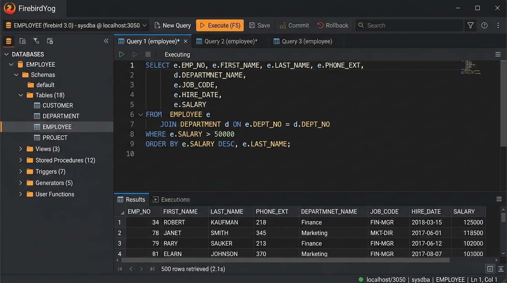

<div align="center">
  
  <h1>FirebirdYog 🔥</h1>
  <p><strong>A modern, lightweight and free Firebird SQL client — built with Electron + React + Monaco Editor</strong></p>

  [](https://opensource.org/licenses/MIT)
  [](https://firebirdsql.org/)
  [](https://github.com/demianabiusi/firebirdyog/releases)
  [](https://github.com/demianabiusi/firebirdyog/actions/workflows/release.yml)
  [](https://github.com/demianabiusi/firebirdyog/actions/workflows/ci.yml)
  [](https://github.com/demianabiusi/firebirdyog/releases/latest)
  [](CONTRIBUTING.md)

  <br/>

  **[⬇️ Download for Windows](https://github.com/demianabiusi/firebirdyog/releases/latest)** · **[⬇️ Download for Linux](https://github.com/demianabiusi/firebirdyog/releases/latest)** · **[🐛 Report Bug](https://github.com/demianabiusi/firebirdyog/issues)** · **[✨ Request Feature](https://github.com/demianabiusi/firebirdyog/issues)**

</div>

---



---

## ❓ Why FirebirdYog?

Firebird SQL is widely used in ERP systems, POS, billing and management software — especially in Latin America and Eastern Europe. But its tooling ecosystem is stuck in the past:

| Tool | Problem |
|---|---|
| **FlameRobin** | Last release 2012. No autocomplete, outdated UI. |
| **IBExpert** | Commercial, Windows-only, expensive for full features. |
| **DBeaver** | Generic Java/Eclipse app. Heavy (500MB+), slow to open. |
| **SQL Workbench/J** | Bare minimum, no Firebird-specific features. |

**FirebirdYog** fills that gap: a free, open source, cross-platform client built on modern technology — giving you a **VS Code-quality editor** and a clean interface designed specifically for Firebird.

---

## ✨ Features

### 🧠 Smart SQL Editor (Monaco — same engine as VS Code)
- **Contextual column autocomplete** — type `TABLE.` or alias `t.` and get instant column suggestions from the live schema
- **Alias resolution** — recognizes `FROM CUSTOMERS c JOIN ORDERS o ON ...` and provides columns for each alias
- **Firebird keywords & functions** — `ROWS`, `FIRST`, `SKIP`, `GEN_ID`, `LIST`, `COALESCE`, `IIF`, `RDB$` system tables and more
- **SQL formatter** — `Ctrl+Shift+F` to format with Firebird-aware dialect
- **Multiple query tabs** — rename, reorder, persist between sessions
- **Configurable shortcuts** — F9/F5 swap mode for SQLyog veterans

### 🗂️ Object Explorer
- **Tables** — columns with types, primary keys, indexes, triggers, DDL generation
- **Views** — DDL inspection and quick query
- **Stored Procedures** — smart detection: executable (`EXECUTE PROCEDURE`) vs selectable (`SELECT * FROM SP(...)`)
- **Triggers** — active/inactive status, associated table
- **Generators / Sequences** — live value inspection via `GEN_ID`
- **Domains, Exceptions** — full DDL browsing
- **Instant search filter** — find any object as you type

### 📊 High-Performance Results Grid
- Virtualized rendering — thousands of rows without freezing
- **In-grid editing** — edit cells directly for single-table queries with primary keys
- Copy cell value with one click
- **BLOB / long text viewer** — double-click any cell
- **Export** — CSV, JSON, SQL INSERT

### 🔄 Schema & Data Diff / Sync
- Visual side-by-side comparison of two databases
- Detects differences in: tables, columns, data types, primary keys, foreign keys, views, stored procedures, triggers, generators, domains, exceptions
- Row-level data diff: missing INSERTs and changed UPDATEs
- **Migration script generator** — ordered by dependency, Firebird Dialect 3 compliant, ready to copy/save/execute

### 📡 Session Monitor (MON$ tables)
- Real-time view of active connections, running statements and transactions
- Kill a query or disconnect a session directly from the UI
- Database health stats: OIT, OAT, transaction gaps, page cache, size on disk

### 💾 Dump & Import
- Export database to SQL script (structure + data)
- Import SQL scripts with progress tracking and error reporting

### 🔒 SSH Tunnel
- Connect to remote Firebird servers through SSH with password or key file

### 🎨 Themes
- Light, Dark, Dracula, Tokyo Night, Solarized, Nord

### 💡 Quality of Life
- Auto-reconnect to last database on startup (configurable)
- Per-connection workspace memory — tabs, queries, history, row limit
- Window state persistence — size, position, maximized state
- i18n: Spanish and English

---

## ⬇️ Installation

### Pre-built binaries (recommended)

Go to the **[Releases page](https://github.com/demianabiusi/firebirdyog/releases)** and download:

| Platform | File |
|---|---|
| **Windows** | `FirebirdYog-Portable-x64.exe` — no installation required, just run it |
| **Linux** | `FirebirdYog-x86_64.AppImage` — make executable and run |

```bash
# Linux: make it executable and run
chmod +x FirebirdYog-x86_64.AppImage
./FirebirdYog-x86_64.AppImage
```

> **Note:** FirebirdYog uses `node-firebird` which communicates with Firebird natively over the network protocol. You do **not** need the Firebird client libraries installed on your machine.

---

## 🛠️ Build from Source

### Prerequisites
- [Node.js](https://nodejs.org/) v18 or later
- [npm](https://www.npmjs.com/) v9 or later

### Steps

```bash
# 1. Clone the repository
git clone https://github.com/demianabiusi/firebirdyog.git
cd firebirdyog

# 2. Install dependencies
npm install

# 3. Run in development mode (Vite + Electron hot-reload)
npm run dev
```

### Build production binaries

```bash
# Build frontend + Electron main process
npm run build

# Package for Windows (portable .exe)
npm run package:win

# Package for Linux (AppImage)
npm run package:linux
```

Output will be in the `release/` folder.

---

## 🏗️ Tech Stack

| Layer | Technology |
|---|---|
| **Framework** | [Electron](https://electronjs.org/) v44 |
| **UI** | [React](https://react.dev/) v19 + [TypeScript](https://www.typescriptlang.org/) |
| **Styling** | [Tailwind CSS](https://tailwindcss.com/) v4 |
| **SQL Editor** | [Monaco Editor](https://microsoft.github.io/monaco-editor/) (VS Code engine) |
| **Build tool** | [Vite](https://vitejs.dev/) v8 |
| **Firebird driver** | [node-firebird](https://github.com/hgourvest/node-firebird) |
| **SSH** | [ssh2](https://github.com/mscdex/ssh2) |

---

## 🤝 Contributing

Contributions, issues, and feature requests are welcome! See [CONTRIBUTING.md](CONTRIBUTING.md) for guidelines.

Quick start:

```bash
# Fork the repo, then:
git clone https://github.com/YOUR_USERNAME/firebirdyog.git
cd firebirdyog
npm install
npm run dev
```

1. Fork the project
2. Create your branch: `git checkout -b feat/my-new-feature`
3. Commit your changes: `git commit -m 'feat: add some feature'`
4. Push to your branch: `git push origin feat/my-new-feature`
5. Open a Pull Request

We use [Conventional Commits](https://www.conventionalcommits.org/) for commit messages.

---

## 🗺️ Roadmap

- [ ] Query execution plan viewer (`PLAN`)
- [ ] Table data editor with `INSERT` / `DELETE` from grid
- [ ] Database creation wizard
- [ ] Result set chart visualizer
- [ ] macOS support
- [ ] Plugin/extension system

---

## 📄 License

Distributed under the **MIT License**. See [LICENSE](LICENSE) for details.

---

## 🙏 Acknowledgements

- [FlameRobin](http://flamerobin.org/) — the OG open source Firebird client that inspired this project
- [node-firebird](https://github.com/hgourvest/node-firebird) — the Firebird driver that makes this possible
- [Monaco Editor](https://microsoft.github.io/monaco-editor/) — for the best-in-class editor experience
- The [Firebird SQL](https://firebirdsql.org/) community — for keeping a great database alive

---

<div align="center">
  Made with ❤️ for the Firebird SQL community · <a href="https://github.com/demianabiusi/firebirdyog/stargazers">⭐ Star this project</a> if it's useful to you!
</div>
